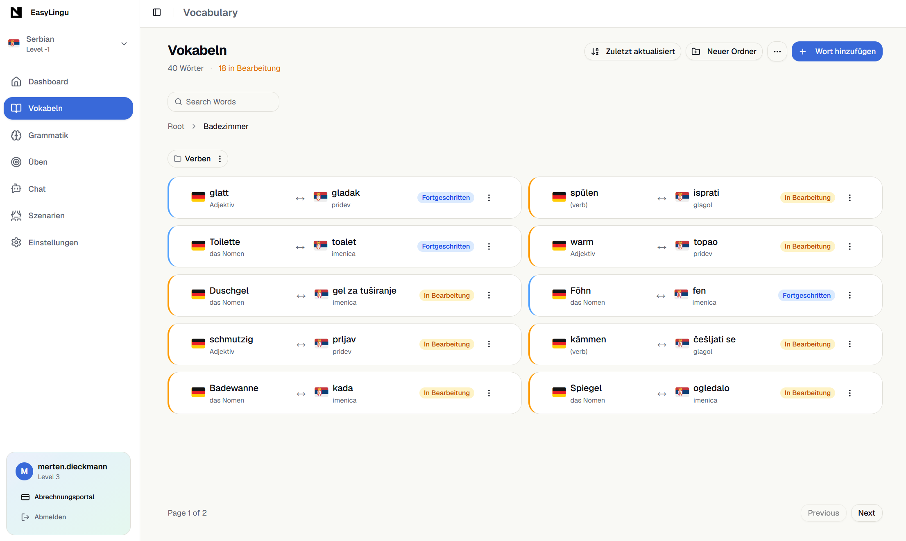
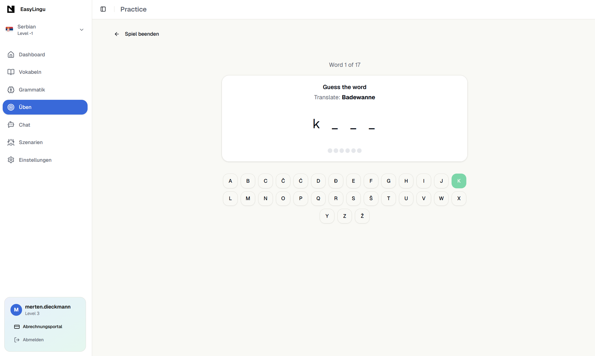
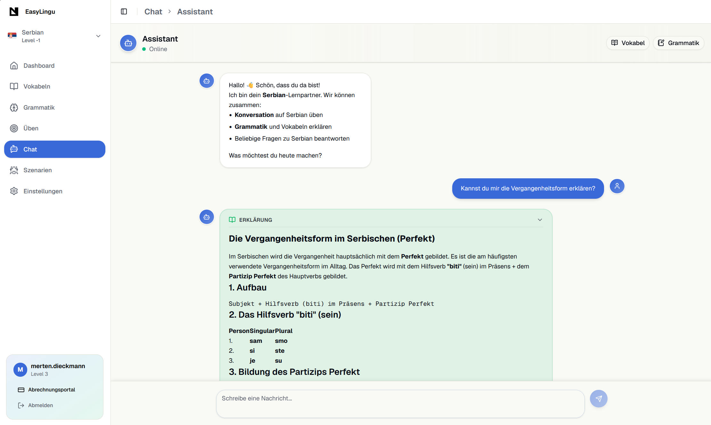
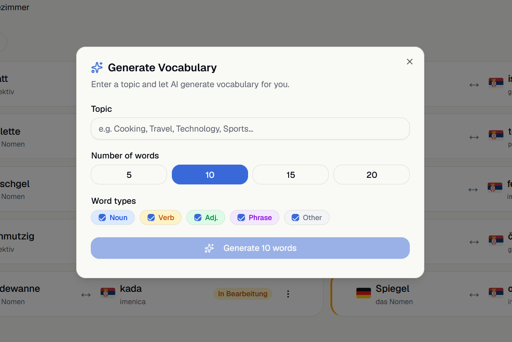
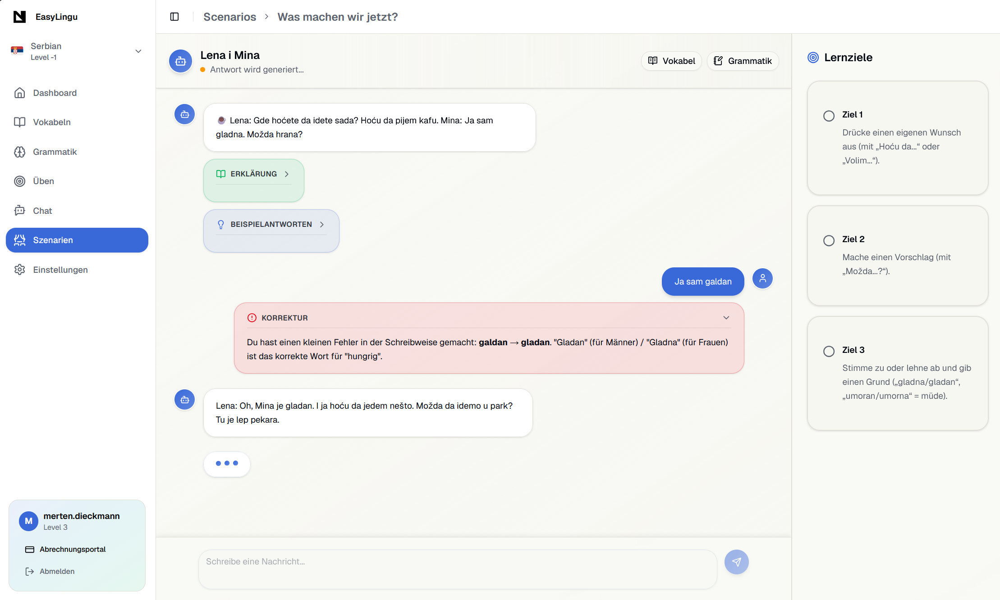
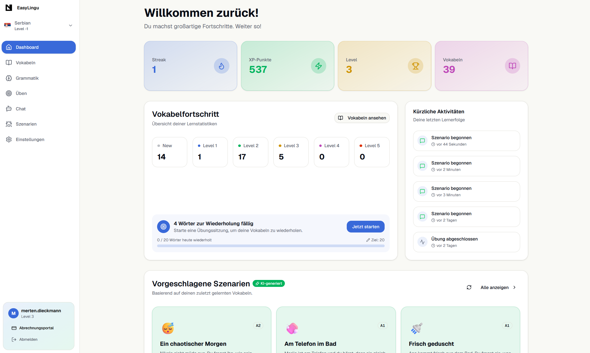

<div align="center">
  
  <h1>EasyLingu</h1>
  <p>AI-powered language learning — vocabulary, spaced repetition, 11 mini-games, and LLM conversation practice</p>

  <a href="https://easylingu.com"></a>
  <a href="https://github.com/MertenD/language-learning"></a>
</div>

---

## About

EasyLingu is a full-stack language learning app where you manage vocabulary in nested categories, track each word through 5 spaced-repetition levels, and practice through 11 interchangeable mini-games. The AI layer — powered by OpenRouter — generates complete vocabulary sets for any topic, personalises chat responses to your CEFR level and known words, and creates conversation scenarios derived from your real vocabulary and progress.

---

## Screenshots

<table>
  <tr>
    <td><strong>Vocabulary</strong><br/></td>
    <td><strong>Practice Session</strong><br/></td>
  </tr>
  <tr>
    <td><strong>AI Chat Tutor</strong><br/></td>
    <td><strong>AI Word Generation</strong><br/></td>
  </tr>
  <tr>
    <td><strong>RAG Scenarios</strong><br/></td>
    <td><strong>Dashboard</strong><br/></td>
  </tr>
</table>

---

## Features

### Vocabulary
Organise words in nested categories with word types (noun, verb, adjective, phrase), grammatical forms (conjugations, gender, plural), and example sentences. Each word is tracked through 5 spaced-repetition levels with automatic review scheduling. Supports CSV import/export and bulk operations.

### Practice Mini-Games
Eleven interchangeable game modes — same vocabulary set, different challenge. Each game has its own XP multiplier.

| Game | XP | Game | XP |
|------|----|------|----|
| Flashcards | 0.5× | Memory | 1.2× |
| Multiple Choice | 1.0× | Matching | 1.2× |
| True / False | 1.0× | Speed Match | 1.2× |
| Reverse Choice | 1.0× | Mixed | 1.3× |
| Typing | 1.5× | Hangman | 1.5× |
| Scramble | 1.5× | | |

### AI Chat Tutor
Streaming LLM chat (DeepSeek-v3.2 via OpenRouter) with structured responses: target-language conversation, native-language explanation, suggested follow-up phrases, and inline mistake corrections. Every response is personalised to the user's actual CEFR level, vocabulary, and grammar notes.

### AI Word Generation
Enter a topic, choose word count and types — the model generates a complete vocabulary set with translations, conjugations, grammatical gender, plural forms, and two example sentences per word. Avoids duplicating words you already have.

### RAG Scenarios
AI generates conversation scenarios adapted to your real vocabulary, CEFR level, and grammar notes. Each scenario has a role, concrete action targets tracked live during the chat, suggested phrases, and a follow-up summary. Scenarios are regenerated on demand (cached 24 h).

### Dashboard
XP, level, streaks, word-level breakdown (new / learning / mastered), recent activity feed, and AI-suggested scenarios based on current progress.

### PWA
Installable on desktop and mobile. TanStack Query cache persists to IndexedDB (7-day TTL). Practice sessions queue offline and auto-sync when back online.

---

## Tech Stack

<div align="center">
  <br/>
</div>

<br/>

**Also uses:** tRPC · Vercel AI SDK · OpenRouter · Inngest · Better Auth · Polar

---

## Getting Started

### Prerequisites
- Node.js 20+
- PostgreSQL database (e.g. [Neon](https://neon.tech))
- OpenRouter API key → https://openrouter.ai

### Local development

```bash
# 1. Clone & install
git clone https://github.com/MertenD/language-learning
cd language-learning
npm install

# 2. Configure environment
cp .env.example .env
# Edit .env — see Environment Variables below

# 3. Run database migrations
npm run prisma:migrate

# 4. Start (Next.js on :3000 + Inngest dev server)
npm run dev:all
```

### Docker (full stack)

```bash
cp .env.example .env
# Edit .env with production values

docker compose up -d
# Starts: app (:3000) · Inngest · Redis
# Migrations run automatically on first start
```

---

## Environment Variables

| Variable | Required | Description |
|---|---|---|
| `DATABASE_URL` | ✅ | PostgreSQL connection string |
| `BETTER_AUTH_SECRET` | ✅ | Random secret for Better Auth |
| `BETTER_AUTH_URL` | ✅ | App base URL (e.g. `http://localhost:3000`) |
| `GOOGLE_CLIENT_ID` | OAuth | Google OAuth client ID |
| `GOOGLE_CLIENT_SECRET` | OAuth | Google OAuth client secret |
| `GITHUB_CLIENT_ID` | OAuth | GitHub OAuth client ID |
| `GITHUB_CLIENT_SECRET` | OAuth | GitHub OAuth client secret |
| `OPENROUTER_API_KEY` | ✅ | API key for AI chat and generation |
| `GOOGLE_GENERATIVE_AI_API_KEY` | AI | Google Gemini key (fallback model) |
| `INNGEST_APP_ID` | ✅ | Inngest application identifier |
| `REDIS_URL` | Optional | Redis connection string for caching |
| `POLAR_ACCESS_TOKEN` | Payments | Polar API token for subscriptions |
| `POLAR_SERVER` | Payments | `sandbox` or production value |
| `POLAR_SUCCESS_URL` | Payments | Redirect URL after successful checkout |
| `SENTRY_AUTH_TOKEN` | Optional | Sentry token for error tracking |

Copy `.env.example` to `.env` and fill in the required values before running.
